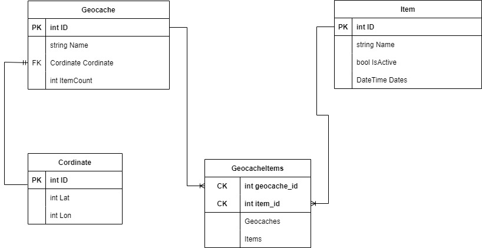
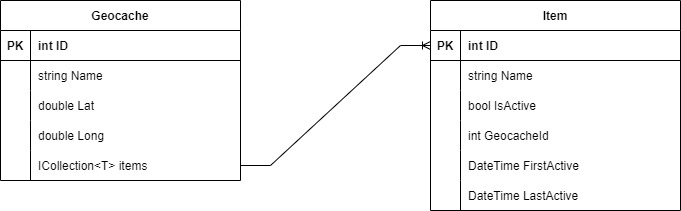
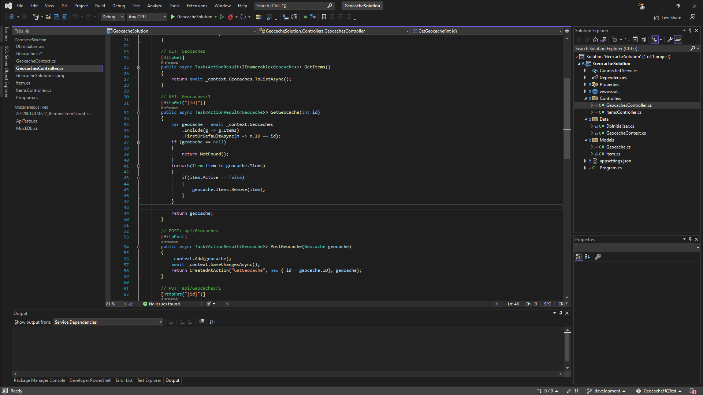
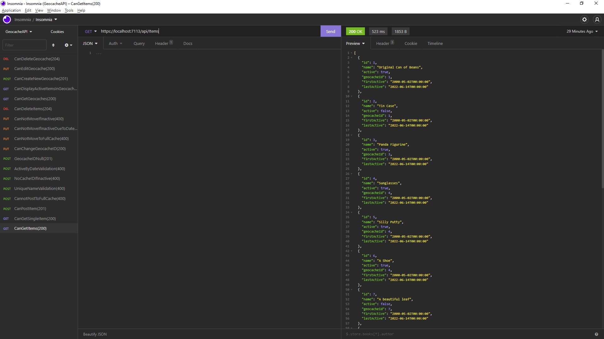
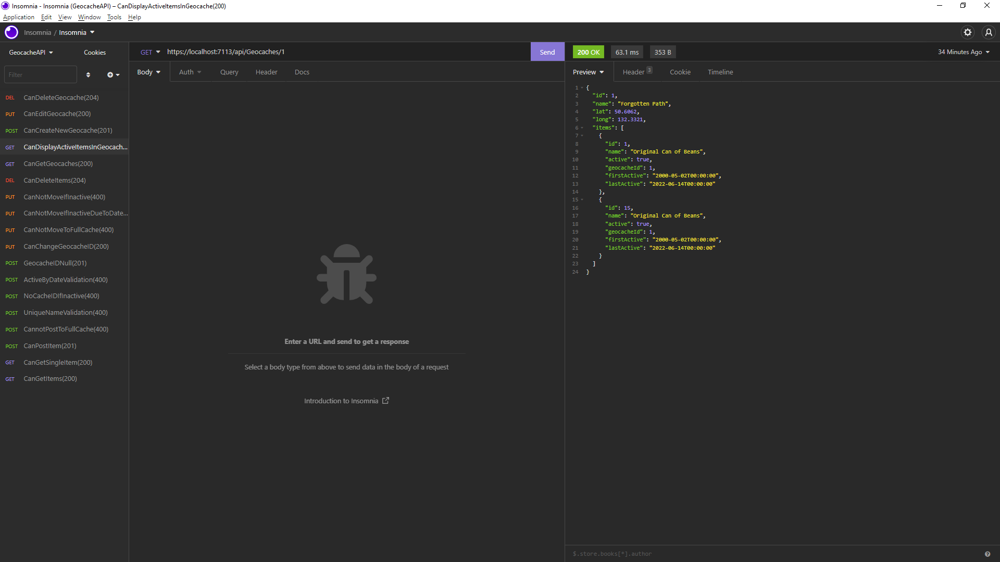

# GeocachingHQTest

> This project was created as part of a skills assessment test for GeocachingHQ. This project is a RESTful SQL database built using Entity Framework Core in .NET6.0.

## Table of Contents

* [General Info](#general-information)
* [Technologies Used](#technologies-used)
* [Features](#features)
* [Approach](#approach)
* [Setup](#setup)
* [Usage](#usage)
* [Project Status](#project-status)
* [Room for Improvement](#room-for-improvement)
* [Acknowledgements](#acknowledgements)
* [Contact](#contact)
* [License](#license)

## General Information

* This is an API used to simulate a simple RESTful geocaching API. In it the user is able to add a geocache to the database with name and cordinate properties. They are also able to add items to the database and assign those items to a specific geocache.
* This application allows a user to store geocache objects and their associated items. It puts limits on the number of items within a specific geocache by giving each geocache a collection of active items that belong to it. The geocache will update it's collection as items are moved from one geocache to another. If an item becomes inactive, the geocache will automatically remove that item from it's collection.
* The purpose of this project was to demostrate competency with database architecture and functionality.

## Technologies Used

* Entity Framework Core
* ASP.NET6.0
* Visual Studio 2022
* Swagger

## Features

* Basic CRUD implementation for a RESTful API.
* Returns correct code responses based on user input(ie, 200 on a successful GET).
* App starts swagger upon Run, allowing for easy use.
* Items automatically become inactive a set number of days after their last activity.

## Approach

I began creating this project by sitting down and drawing out an Entity Relation diagram. After playing with the models for a moment, I realized I had overcomplicated the problem and drafted a much simpler model.

Once I had that worked out, I created my Models in Visual Studio. I went through a few iterations of what exact data I wanted stored and how to store it. The FirstActive and LastActive were puzzling to me at first, as I wasn't sure how to use them. I tried to imagine a real world scenario, and what I came up with was that LastActive wouldn't be so much an expiration date, but rather a way to see if the item was being interacted with. So in my logic I decided that an Item would become inactive (active = false) if LastActive was more than thirty days prior to the date on which the Item was being modified.

In order to display the active items with the Geocache, I decided to have Items be a collection. This way I could use the Count method to validate whether the cache was full or not AND use the collection to display all active items belonging to that cache, rather than having to keep a seperate count.

As I went I would test each bit of logic in Insomnia to make sure I was getting back the correct code with appropriate messages dependent on input. In this way I was able to workthrough all of the assignment contraints and run them against real seeded data in a running database.

I also added Swagger to make it easier on anyone downloading my application. While I did most of my testing in Insomnia, I didn't want to rely on other users downloading and using that software in order to make sense of my application. I programmed the application so that swagger opens immediately on start up.

## Other Notes

I chose to write this program in .NET6.0, which, given the time constraints, probably wasn't wise. The bulk of my education happened in .NET5.0 and I have not spent a lot of time coding in .NET6.0. That said I think the exercise was worth my while and I learned quite a bit, but I did spend more time in the beginning getting things set up than I would have liked(moving all StartUp functionality into Program, for example, took a bit to wrap my brain around and be sure I understood how the new wiring worked).

I would also want to add interfaces for my models and a service layer. This is a small app with only two models, so at this stage an interface isn't strictly necessary, but if I wanted it to be more scaleable that would be helpful. A lot of the API business logic currently lives in the controllers, and I'd like to decouple those as much as possible. Decoupling would also make it easier to write and implement unit tests in the future. More so than unit testing, I wanted write integration tests. This was one area where .NET6.0 got in my way, and I wasn't quite able to figure out how to implement them before deadline. While I see some value in creating a mock and testing off of the mock, I feel like integration tests are more useful in testing out how the API functions for the user in a more real enviornment.

One win for me was learning how to use validation tags on my models. I had initially written the Regex Logic to test Item names inside the controller, and then realized it could be attached to the model iself.

Overall I feel like this is a tight and succinct API that may have room for improvements, but is ultimately capable of doing everything it needs to do. Thank you for taking the time to look over my README and review my application.

## Setup

Project must be run in ASP.NET6.0 using Visual Studio 2022.
Install the following packages before starting:

* MicrosoftAspNetCore.Diagnostics.EntityFrameworkCore
* Microsoft.EntityFrameworkCore
* Microsoft.EnttiyFrameworkCore.SqlServer
* Microsoft.EntityFrameworkCore.Tools
* Swashbuckle.AspNetCore.Swagger
* Swashbuckle.AspNetCore.SwaggerGen
* Swashbuckle.AspNetCore.SwaggerUI

## Acknowledgements

My friends and coworkers who put up with my absence over the last week.
Also the Microsoft Web Api [Documention](https://docs.microsoft.com/en-us/aspnet/core/?view=aspnetcore-6.0) and tutorials were invaluable. 

## Contact

Created by [Joshua Haddock](https://www.linkedin.com/in/joshuahaddock/) - feel free to contact me!
